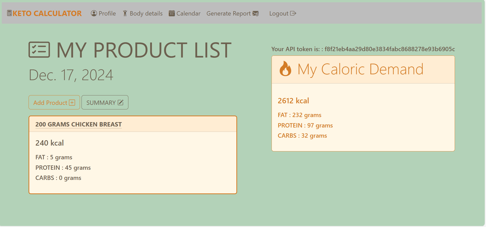

# ketoApp 
<h1>KETO CALCULATOR</h1>

## Description

This repository is a Django application that enables the user to:

- Create a profile 
- Calculate daily calorie requirement
- Download the caloric value of individual products from an external API
- Summing up the calories of all consumed products during the day
- See a profile with saved information
- See full calendar with daily calorie summary

### Technologies Used:

- Python 3.11
- Django 5.3
- Sqlite3 3.43
- Docker
- Docker-compose
- JavaScript
- Bootstrap 5.3
- fullcalendar.io

### How to run locally:

1. Clone the repo

    https://github.com/pStojczyk/ketoApp.git

2. Install requirements
 
    _pip install -r requirements.txt_

3. Run Docker

    `docker-compose up --build`

4. Open localhost in your browser

    _localhost:8000_
